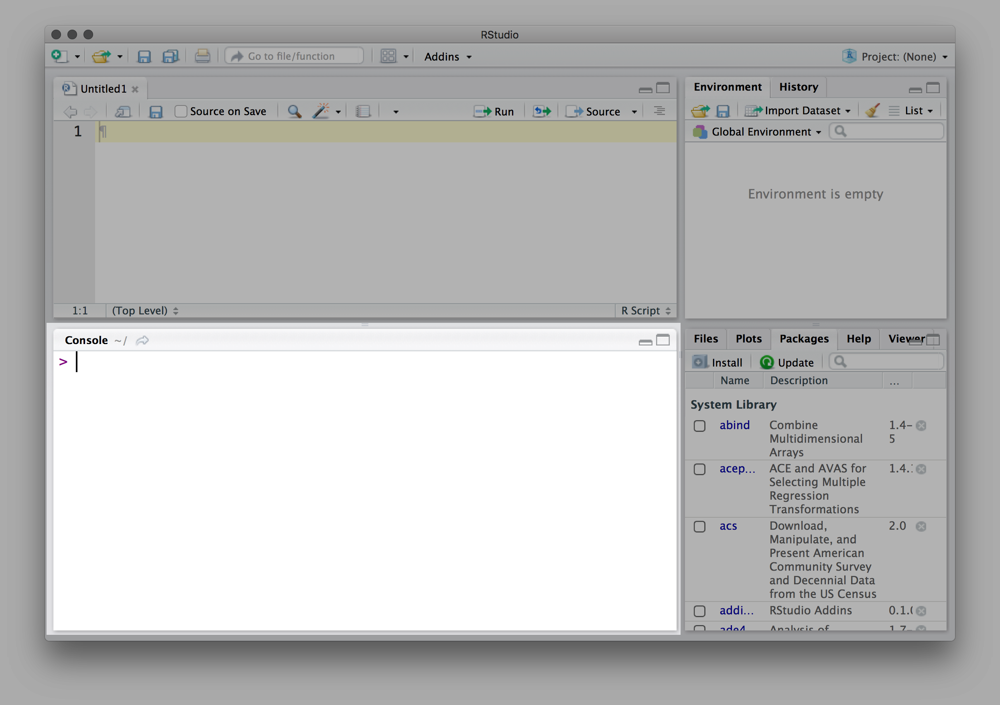
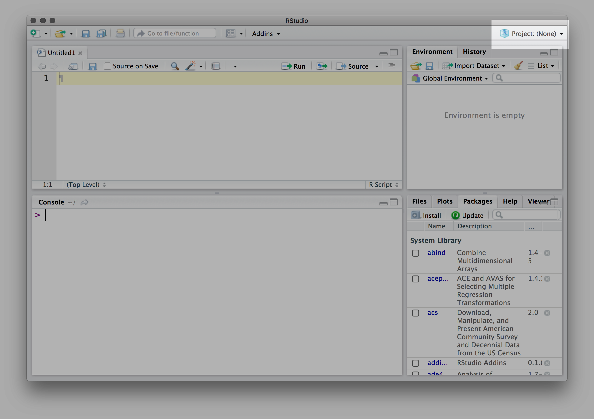

    
# Introduction
## About `R`
[`R`](https://cran.r-project.org/) is a popular, free programming language focused specifically on statistical computation and visualization.[^0] It is a compromise between languages that require expert coding skills and statistical knowledge and commercial software packages with graphical user interfaces and proprietary models.[^1] As such, it has a thriving user community with [over 6700 contributed packages](http://blog.revolutionanalytics.com/2015/06/how-many-packages-are-there-really-on-cran.html) -- including the popular ~~[Hadleyverse](http://blog.revolutionanalytics.com/2015/03/hadleyverse.html)~~  [`tidyverse`](https://blog.rstudio.org/2016/09/15/tidyverse-1-0-0/). 

## Goals of the tutorial
This tutorial is for people who have never used `R` before. It is designed to get you familiar with `R` syntax, basic operations, basic data structures, and basic data objects. By the end of this, you will hopefully:

1. Have `R` and `RStudio` installed (also the `deSolve` package)
2. Know how to create and index different data objects
3. Be familiar with common `R` commands
4. Import data
5. Plot histograms, densities, lines, and points

With these basics down, creating models and solving ODEs in `R` will be much easier.

# Preparation
## Installing `R` and `RStudio`
By now, you should have already installed both `R` and `RStudio`. If not, [Swirl](http://swirlstats.com/students.html) has a great page on how to do so. I suggest you go there and follow Steps 1 and 2, but the short of it is this:
    
1. **Install `R` from [CRAN](http://cran.rstudio.com/)**. Go to the [CRAN website](http://cran.rstudio.com/) and download the version of `R` for your operating system. 
    - `macOS` and `Windows` users should use the precompiled links at the top of the page. `Linux` users should check their package manager.

2. **Install `RStudio` IDE**. Go to the [`RStudio` website](https://www.rstudio.com/products/rstudio/download/) and download the free version of `RStudio Desktop` that is appropriate for your operating system. 
    - **NOTE**: Make sure you've installed `R` from Step 1 **first**. 
    - While `R` itself is a programming language with a very basic command-line interface, `RStudio` allows you to modify, visualize, and run your `R` code in a unified, user-friendly interface. It is not strictly necessary, but it is *highly* recommended.[^2]
    
## Using `RStudio`
Now let's open `RStudio` and take a look around. It should look something like this.


### Source
In the upper left is the `source` pane where you will be writing your code.
 

### Console
In the lower left is the `console` pane where you will run code and see output.
 

### Peripheral
On the lower right is a set of peripheral tabs: where your help, plots, etc. will show up.
 

### Environmental
Upper right will have environmental things -- objects you store during your session.
 

### Projects
The key to using `RStudio` is to organize things into "Projects". A project is just a folder on your computer that will contain all your code as well as metadata (for example, a history of your commands will be saved even when you close the program), and any objects you had in the environment. You can create new projects, open projects, and check which project you are currently in by looking in the upper right.
 

## Installing packages
For the class, we will need the [`deSolve` package](http://desolve.r-forge.r-project.org/). To install it, open `RStudio` and run this code:
```{r, eval=FALSE}
install.packages("deSolve")
```

Here, `install.packages()` is a function[^3] that will -- you guessed it, install the package `deSolve`. While optional, you should probably also install `tidyverse` which is a set of popular `R` packages commonly used in data analysis. Try it on your own.[^6]


# Useful info before we get started
## Getting `R` help
Inevitably, you'll need help. [Google](http://google.com) and [StackOverflow](http://stackoverflow.com/questions/tagged/r) are your best friends. When searching, it is often more efficient to add "cran", "stats", "rstats", or "solved" to your query for more relevant results.

To get built-in help, you can use the `?`, `??`, or `help()` functions. For example, if you wanted help on the `plot()` function:
    
```{r, eval=FALSE}
?plot
```
You could also use `??plot` or `help(plot)`. The `??` is a more general search function and the `help()` command is useful when searching for symbols -- for example, try `help('?')`.

If you need more help, definitely use Canvas discussion board, office hours, or email me.

## Comments in code
Throughout the course, I will try to comment as much of the code as possible to help you see what is going on and where you can modify your models. To use comments in your code, use the `#` symbol to ignore the rest of the line.
```{r, eval=FALSE}
# This is a comment and R will ignore this.
# pi is an object so R will print its value.
pi 

cos(pi)   # R will output this command
# but then ignore the rest of the line.
```

## Case-sensitivity
Unlike some programming languages, `R` is case-sensitive. A variable named `x` is not the same as a variable named `X`. When following along below, be careful of this.

# Getting started in `R`
Let's just quickly get used typing in and reading output in `RStudio`. Throughout this section, I will give you code. You should try typing it in yourself (not copying and pasting) and verifying it works as you expect.

## Assignment and variables
In `R`, we use `<-` to assign something from the right side of the arrow to the left.[^4] In `RStudio`you can use *ALT+—* as a shortcut. For example `x <- 5` assigns the value `5` to the variable `x`.[^5] 

You can use **almost** anything as a variable name as long as it starts with a letter and only contains alphanumeric characters and `_` or `.`. For example, `pi` is a variable in `R`. Type `pi` or `print(pi)` to see for yourself. Then assign the value `pi * 1^2` to the variable `area`.

### Sidenote about naming things
Note that `R` will let you overwrite built-in objects, **but you really shouldn't**. For example, `list()` and `c()` are two very common functions. Don't name things `list` or `c`. In general, object names should be lowercase with an underscore to separate words. You want names to be short but meaningful. See [this `R` styleguide](http://adv-r.had.co.nz/Style.html) for more.

## Data types
There are six data types in `R` but we only care about 4: 

1. **logical** - Boolean values, e.g., `TRUE` or `FALSE` 
2. **numeric** - decimal (floating point) values, e.g., `2.6` or `1.0`
3. **integer** -  whole numbers, e.g., `3`, or `-1` 
4. **character** - strings, e.g., 'infected'

To see the data type of an object just use `typeof()`:
```{r eval=FALSE}
one_to_five <- 1:5      ## the colon generates an integer sequence start:finish
typeof(one_to_five)     ## Returns `integer` which is a numeric type

true_true <- c(TRUE, TRUE)
typeof(true_true)       ## Returns `logical`
false_false_true <- c(FALSE, FALSE, TRUE)

typeof(pi)              ## Returns `double` another numeric type
typeof('pi')            ## Returns `character` because of the quotations
```

## Data objects
You can store these data types into objects or collections:

1. **vector** - a $1$-dimensional array of the same type.
    - Use `c()` to create a vector
    - For example: `sentence <- c("this", "is", "an", "array", "of", "characters")`
    - Mixing data types coerces all elements inside the vector to the most flexible type. 
    - For example, `strings <- c(1, 2.3, 5, '6')` becomes a vector of characters.
2. **list** - A container that can have anything else (including another list) as an element.
    - `multi_list <- list(c(1, 2, 3), pi, 'string', list(10, 1i))`
    - Unlike a vector, lists can have different data types in the same object.
3. **matrix** - a $2$-dimensional array of the same type
    - Think of a matrix as vectors of equal length combined together.
    - Like a vector, if you mix data types, it will coerce everything into the most flexible type.
    - `neo <- matrix(c(1, 2, 3, 4, 5, 6), nrow = 3, ncol = 2)` will create a $3 x 2$ matrix (columns first) of integers.
    - `not_neo <- matrix(c(1, 2, 3, 4, 5, 'six'), nrow = 3, ncol = 2)` will create a matrix of characters because `'six'` is a string.
4. **dataframe** - a $2$-dimensional array where each column is of the same type
    - This is the tabular data format we are most used to -- each column represents a variable and is of the same type but not all columns need to be of the same type.
    - `neo_df <- as.data.frame(neo)` will convert our matrix into a dataframe
    - `print(neo_df)` will show you the dataframe with column names `V1` and `V2`.
5. **array** - an $n$-dimensional version of a matrix. We probably won't use it much, but it's good to know it exists.
    
## Indexing
### Indexing $1$-dimensional objects
There are several ways to extract an element from an object. The easiest is to use brackets (`[]`). For example, `sentence[1]` will return the first element of the object `sentence` we created above.

```{r eval=FALSE}
sentence[1]
# returns: [1] "this"
```

You can get multiple elements by creating a vector of indices. For example, `c(1, 6)` will create a vector of two elements -- `1` and `6`. You can then use this vector as indices for another object.
```{r eval=FALSE}
sentence[c(1, 6)]
# returns: [1] "this"       "characters"
```

Hint: You can quickly create a sequence of integers by using the `:` (colon). Try typing `1:3` in your console. Then use this method to index the first three element `strings`.

### Indexing with booleans
You can use `TRUE` and `FALSE` to index a vector. For example, `sentence[c(TRUE, TRUE, FALSE, FALSE, FALSE, TRUE)]`.

### Indexing $2$-dimensional objects
Similarly, you can index an element from a matrix by specifying the rows and the columns, separated by a comma.
```{r eval=FALSE}
neo[1, 2]
# return `3` which is the element from the first row and second column

neo[c(2, 3), c(1, 2)]  # what does this return?
```

For dataframes, you can use the above method, or you can refer to the variable (column) name with the `$` symbol, or by using strings around the column name.
```{r eval=FALSE}
neo_df$V2[1]
# return `3` which is the element from the first row and second variable

neo_df[1, 'V2'] # Same as above
```

Note that when passing a single index, matrices and dataframes behave different. Try typing `neo_df[2]` and comparing it to `neo[2]`.

### Indexing a list
Because lists can contain other sublists (which can contain subsublists), lists are indexed using layers. The double bracket `[[]]` will index the first object and you can then use single brackets as you would above.

```{r eval=FALSE}
multi_list[[1]][3]
# return `3` third element from the first element of the list

multi_list[[1]]
# returns the entire first element (1, 2, 3)
```

Which index of `multi_list` will return `1i`?

## Note about expressions

All operators in `R` are the standard functions. Adding, substracting, multiplying, and dividing are the usual `+`, `-`, `*`, `/` operators. However, `R` is vectorized so operators act on vectors in a way that may not always be intuitive.

- **scalar / scalar** - `5 * 4` will return `20` as expected. 
- **scalar / vector** - `5 * c(4, 5, 6)` multiplies the entire vector by `5` to return `20, 25, 30` as expected.
- **vector / vector (equal length)** - `c(1, 2, 3) * c(4, 5, 6)` will perform element-wise multiplication.
- **vector / vector (multiple length)** `c(1, 2) * c(3, 4, 5, 6)` will perform element-wise multiplication for the length of the first vector and then repeat. Try it to see what happens.

You cannot multiple two vectors unless the length of the shorter one is a multiple of the longer one. 

To see all arithmetic operators, type `help('+')`.

## Common commands
These are common `R` commands you will use throughout the course. Try them or use `help()` to learn more.

- `<-` assign the value on the right side to the object on the left side, e.g., `x <- 5`
- `seq()` - create a sequence of numbers by a specified step length, e.g., `seq(0, 1, by = .01)` creates a vector $[0, .01, .02, .03 ... .99, 1]$.
- `:` - create a sequence of *integers* from `start:end`, e.g., `-2:2`
- `c()` - concatenate objects together, e.g., `c(1:5, 6:10)`
- `cbind()` - combine two vectors as `c`olumns, i.e., side by side, `cbind(1:5, 6:10)`
- `rbind()` - combine two vectors as `r`ows, i.e., one on top of the other, `rbind(1:5, 6:10)`
- `list()` - create a list of elements, e.g., `list(1:5, 6:10, list(c(1:5, 6:10)))`
- `library()` - load a package, e.g., `library(deSolve)`
- `!`, `&`, `|` - logical operators `not`, `and`, and `or` respectively
- `str()` - tells you the structure of an object
- `summary()` - summarize an object

# Read in a `csv` file
In the "Data Sets" folder on [the Canvas site](https://canvas.harvard.edu/courses/25374/files/folder/Data%20sets), download the `play_data.csv` file.

## The "hard" way
Use the `read.csv()` command to save the file to a variable. For example:
```{r eval=FALSE}
df <- read.csv('./play_data.csv')
str(df)

# Outputs:
# 'data.frame':	11 obs. of  8 variables:
# $ x1: int  10 8 13 9 11 14 6 4 12 7 ...
# $ x2: int  10 8 13 9 11 14 6 4 12 7 ...
# $ x3: int  10 8 13 9 11 14 6 4 12 7 ...
# $ x4: int  8 8 8 8 8 8 8 19 8 8 ...
# $ y1: num  8.04 6.95 7.58 8.81 8.33 ...
# $ y2: num  9.14 8.14 8.74 8.77 9.26 8.1 6.13 3.1 9.13 7.26 ...
# $ y3: num  7.46 6.77 12.74 7.11 7.81 ...
# $ y4: num  6.58 5.76 7.71 8.84 8.47 7.04 5.25 12.5 5.56 7.91 ...

summary(df)
```

Obviously, change the file path to where the file is on your computer. (Keep the name `df` though.)

## The easy way
The easiest way to import data is to use the `RStudio` import dialog under `File > Import Dataset > From CSV`. Locate the file and `RStudio` will try to correctly parse the file for you. You can also see the command it uses in the `Code Preview` section of the dialog box. Don't forget to change the name to `df`.


# Basic plotting
## Points
The most basic plotting function in `R` is `plot(x, y)`, which takes at least two arguments -- one for the `x` data points and one for a vector (of equal length) for the `y` data points.

For example, to plot the `x1` and `y1` columns frmo the `df` dataframe, we use:
```{r, message=FALSE, warning=FALSE, include=FALSE}
df <- read.csv('./data/play_data.csv')
```

```{r}
plot(df$x1, df$y1)
```

Try plotting one of the other three sets of coordinates.

Of course, `plot()` has many other arguments. For example, we could specify a different `type` of plot with the `type` argument. We could also specify a different title (`main`), x and y axis labels with `xlab` and `ylab`, respectively, and color with `col`.

```{r}
plot(df$x1, df$y1, 
     type = 'l', 
     main = 'Anscombe 1', xlab = 'X', ylab = 'Y', 
     col = 'blue')
```

Here, the `l` argument corresponds to "line" -- unfortunately, it doesn't make much sense with our current data. The default is `p` for "points". See `?plot` for more options.

```{r}
plot(df$x1, df$y1, 
     type = 'p', 
     main = 'Anscombe 1', xlab = 'X', ylab = 'Y', 
     col = 'red', 
     xlim = c(0, 14), ylim = c(0, 11))
```

It is often useful to change the limits on the `x` and `y` axes. You can do so with `xlim` and `ylim`, respectively. Each argument takes a $2$-element vector with the first being the lower limit and the second being the upper limit.

While, `plot()` will initiate a new plot, sometimes, you just want to add data to an existing plot. You can add lines with `lines()` and points with `points()`. For example:

```{r}
plot(df$x1, df$y1, 
     type = 'p', 
     main = "Anscombe's Quartet", xlab = 'X', ylab = 'Y', 
     col = 'red', 
     xlim = c(3, 14), ylim = c(2, 11))

points(df$x2, df$y2, col = 'blue')
points(df$x3, df$y3, col = 'green')
points(df$x4, df$y4, col = 'black')

abline(lm(df$y1 ~ df$x1), col = 'red')
```

## Plotting histograms
You can also plot histograms and densities in `R`. Let's use `rnorm()` `r`andomly draw from the `norm`al distribution.

```{r}
standard_normal <- rnorm(10000, mean = 0, sd = 1)

hist(standard_normal)
plot(density(standard_normal))
```

# Other resources

`RStudio` has a [great set of cheatsheets](https://www.rstudio.com/resources/cheatsheets/) that are useful when first learning.

`R` is a super powerful language and this tutorial only provides the tiny sliver you'll need for this class. There are a ton of online resources to learn more about `R`:

- [Data Camp](https://www.datacamp.com/courses/free-introduction-to-r)
- [rOpenSci](http://ropensci.org/)
- [Cyclismo](http://www.cyclismo.org/tutorial/R/)

# Footnotes
[^0]: Yes, there are other similar free programming languages such as `Python`, but we prefer the packages `R` has readily-available for solving and plotting ODEs. 
[^1]: See [this Nature article](http://www.nature.com/news/programming-tools-adventures-with-r-1.16609) for more.
[^2]: Seriously. Don't be like Professor Buckee -- install `RStudio`.
[^3]: In fact, whenever you see parenthesis in the code, it is a function. Code without parentheses are usually objects.
[^4]: Technically, you can use a right assignment (e.g., `5 -> x`), equals (e.g., `x = 5`), or global left/right assignment (e.g., `x <<- 5`). For this class, you **should** always use `<-` or `=`. 
[^5]: Note that `<-` is just a convenient shortcut for the function `assign()`. See `help(assign)` for more.
[^6]: You can also install packages by clicking on the "Install" button in the Packages tab of the peripheral (lower right) pane. 